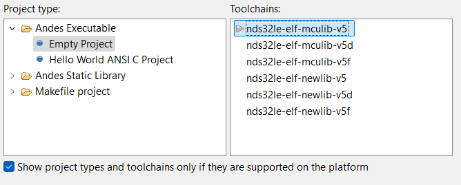
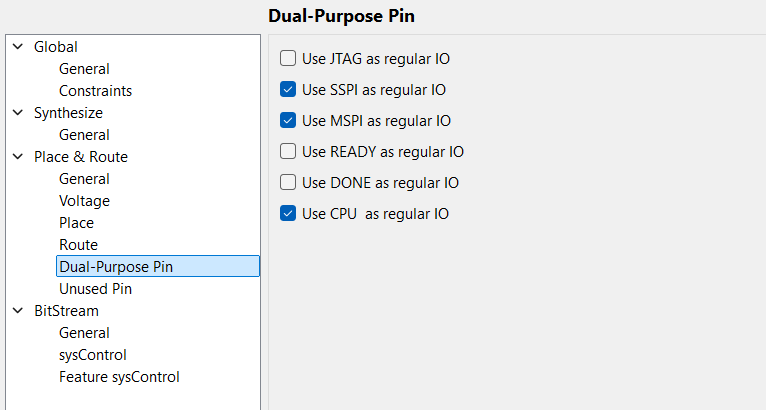

# TangMega-138K-AE350

## Настройка работы ПЛИС в составе Gowin FPGA

Для начала нужно уточнить, что на плате присутствуют два USB Type-C порта, они служат для разных целей и требуют разных драйверов. Для прошивки FPGA и Risc-V нужен USB-2, который подписан как Debug.  
Для его работы нужен драйвер FT2232H ([Ссылка на скачивание](https://ftdichip.com/drivers/d2xx-drivers/)).


Также для успешной прошивки нужно включить свитчи на плате следующим образом:


Также чтобы успешно прошить плату, необходимо включить ее. Питание можно подавать напрямую через USB Type-C порт или через специальный порт для питания.

Порт для питания можно также увидеть на рисунке выше. При достаточном питании светодиод DC IN загорится.

Кроме подключения питания необходимо на 2–5 секунд зажать кнопку POWER на плате.


После чего при пустой прошивке на ПЛИС загорится светодиод POWER.


Если этот светодиод не горит, то, скорее всего, FPGA не получает питания.

Для написания прошивки для FPGA необходимо установить GOWIN EDA с полной лицензией, иначе доступ к IP-ядрам будет ограничен, и работа с Risc-V может быть недоступна.

Со всеми ресурсами непосредственно FPGA и платы можно ознакомиться на [странице производителя](https://wiki.sipeed.com/hardware/en/tang/tang-mega-138k/mega-138k.html).

Для проверки работы FPGA можно написать небольшой код для мигания диодами на PMOD.

Если прошивка была успешно синтезирована и загружена на плату, то вы должны увидеть, как загорятся два остальных диода с рисунка выше, а после, если у вас подключен PMOD-LED, вы увидите работу вашей прошивки.

Так как основной целью было исследование работы именно Risc-V в составе платы, перейдем к нему.

## Настройка работы Risc-V в составе Gowin FPGA

#### Получение среды разработки

Для написания прошивок для Risc-V в составе платы нужно либо скачать набор инструментов для сборки и компиляции файлов с официального GitHub AndesTech, либо получить лицензию от Gowin для AndeSight RDS.  
Для получения лицензии на AndeSight нужно заполнить форму [по ссылке](https://www.gowinsemi.com/en/support/enquires/). Можно заполнить по образцу ниже.


Все поля, кроме пустых, нужно заполнить именно так, иначе вы либо не получите лицензию, либо получите не ту. Лицензия бессрочная, но позволяет работать только с одним микроконтроллером, именно той модели, которая находится на одном кристалле с ПЛИС.  
Ожидание ответа может доходить как минимум до 3 дней.

После получения ключа и файла лицензии вам стоит скачать AndeSight RDS с официального сайта GOWIN ([ссылка на скачивание](https://cdn.gowinsemi.com.cn/RiscV_AE350_SOC_RDS_V1.3_win.zip)).

После скачивания программы при первом запуске появится окно с просьбой ввести лицензию, где вы вводите Serial и License File из письма.

#### Подготовка среды разработки

Теперь желательно скачать `demo_ae350` для сборки программ под данный микроконтроллер. Данную сборку можно найти в стороннем GitHub-репозитории ([ссылка](https://github.com/faa00/Tang_MEGA_138K_Pro_Dock)).  
В данном репозитории есть 3 папки: 2 из них — это проекты для ПЛИС, которые пока можно игнорировать, а папка `software/ae350_test/` — это набор файлов для успешной компиляции тестовых прошивок под AE350 в составе GOWIN FPGA.  
Они очень полезны, когда вы проверяете, правильно ли передаете файл прошивки на ПЛИС, а также правильно ли вы внутри прошивки для ПЛИС распределили ресурсы платы. Как их распределять, мы обсудим в следующей главе, а пока вернемся к AndeSight.

Для начала нужно создать пустой проект в AndeSight, как показано ниже:




Для успешной прошивки нужно добавить из папки `ae350_test` папку `src` в ваш пустой проект. После кликните правой кнопкой мыши по папке проекта и откройте Properties.

Теперь нужно настроить параметры сборки проекта. Сначала укажите все папки, в которых находятся файлы заголовков и их реализации, чтобы компилятор знал, куда обращаться. В будущем, если вы захотите создавать свои папки и файлы, вам тоже нужно будет указать пути до них.

По пути `C/C++ Build -> Settings -> Andes C Compiler -> Directories` добавьте следующие пути:

- `${workspace_loc:/${ProjName}/src/bsp/ae350}`
- `${workspace_loc:/${ProjName}/src/bsp/config}`
- `${workspace_loc:/${ProjName}/src/bsp/driver/ae350}`
- `${workspace_loc:/${ProjName}/src/bsp/driver/include}`
- `${workspace_loc:/${ProjName}/src/bsp/lib}`
- `${workspace_loc:/${ProjName}/src/demo}`


Проще всего это сделать через кнопку `File System`, так как там можно выбрать все пути сразу, а AndeSight сам их подставит.


Теперь настройте оптимизацию по пути `C/C++ Build -> Settings -> Andes C Compiler -> Optimization`. Установите следующие параметры:

- Optimization Level: `-Og` (Optimize for speed with better debug ability than O1)
- Code Model: medium
- Remove unused function sections (`-ffunction-sections`): Enable
- Remove unused data sections (`-fdata-sections`): Enable


Это поможет экономить ресурсы и улучшить отладку, хотя с настройками можно экспериментировать, так как они почти не влияют на прошивку.

Также можно выставить уровень отладки по пути `C/C++ Build -> Settings -> Andes C Compiler -> Debugging`.


Я выставил максимальный, вы можете выбрать любой.

В `C/C++ Build -> Settings -> Andes C Compiler -> Miscellaneous` в пункт `Other flags` добавьте: `-c -fmessage-length=0 -fno-builtin -fomit-frame-pointer -fno-strict-aliasing`, а компилятор выберите `gcc`.


Кроме настройки компилятора, нужно настроить линковщик. По пути `C/C++ Build -> Settings -> LdSaG Tool -> General` в качестве `Linker script template` укажите: `$(ANDESIGHT_ROOT)/utils/nds32_template_v5.txt`.  
В `SaG file` укажите: `${ProjDirPath}/src/bsp/sag/ae350-ddr.sag`.


Затем по пути `C/C++ Build -> Settings -> Andes C Linker -> General` в пункт `Linker Script (-T)` введите: `$(LDSAG_OUT)`. Пункт `Do not use standard start files (-nostartfiles)` должен быть включен.


Теперь вы можетеビルдить проект, нажав левой кнопкой мыши по папке проекта и выбрав молоток на панели сверху.


В демо-проекте из репозитория по умолчанию будет программа `led waterfall` и проверка памяти, где выделяется память для массивов `a` и `b`, массив `a` заполняется значениями, они копируются в `b`, выводятся через UART, а затем память очищается и освобождается.

Кроме этих простых примеров, есть и другие, которые можно включать или выключать, меняя значения в `demo.h`. На основе этих примеров вы можете писать свои прошивки. К сожалению, документации по этим инструментам я не нашел.

Все тестовые прошивки вызываются из `main.c`.

Послеビルда появится папка `debug`, в которой лежит бинарный файл вашей прошивки. Его нужно залить на микроконтроллер, но это не так просто, так как для прошивки AE350 сначала нужно прошить ПЛИС.

## Подготовка ПЛИС для работы с Risc-V

#### Подготовка среды

Из упомянутого ранее репозитория можно скачать одну из двух прошивок для ПЛИС. Я использовал `ae350_demo`, хотя они мало отличаются.

Скачивать их необязательно, так как вы можете настроить все самостоятельно, следуя инструкциям ниже. Однако я рекомендую взять готовый проект из репозитория ([ссылка для Tang 138K](https://github.com/sipeed/TangMega-138K-example)) или ([ссылка для Tang 138K Pro](https://github.com/sipeed/TangMega-138KPro-example/tree/main)).

Если вы создаете проект с нуля, используйте следующие настройки:

- Series: GW5AST
- Device: GW5AST-138
- Device Version: B
- Package: FCPBG484A
- Speed: C1/I0
- Part Number: GW5AST-LV138FPG676AC1/I0

Для начала подготовьте среду, подключив все IP Core. Начнем с настройки среды.

Перейдите в `Project -> Configuration -> Global -> General` и включите DRSM, чтобы использовать DDR3 на плате.


Далее в `Place & Route` настройте пункты `Place` и `Route`, как показано ниже:


Также переопределите некоторые пины в `Dual-Purpose Pin`. Если вы не переопределяете JTAG, настройте как на рисунке:



#### Подключение IP Core

Добавьте необходимые IP Core. Первый — `RiscV AE350 SOC`, находится по пути `Soft IP Core -> Microprocessor System -> Hard-Core-MCU`.

При добавлении выберите, что подключить к AE350. Для проверки работоспособности достаточно добавить GPIO и UART2, как показано:


Также добавьте PLL для преобразования частот. По пути `Hard Module -> CLOCK -> PLL_ADV` добавьте два PLL:

1. Для:
   - Clkout0: DDR clock - 50 MHz
   - Clkout1: CORE clock - 800 MHz
   - Clkout2: AHB clock - 100 MHz
   - Clkout3: APB clock - 100 MHz
   - Clkout4: RTC clock - 10 MHz

2. Для DDR3:
   - Clkout0: DDR3 input clock - 50 MHz
   - Clkout2: DDR3 memory clock - 200 MHz

Начальную страницу PLL настройте, как показано:


Также рекомендую добавить следующий модуль для визуализации работы кода:

```verilog
// Debounce by key
module key_debounce(out, in, clk, rstn);

input  in;
input clk;      // 50MHz
output out;
input rstn;

reg in_reg0;
reg in_reg1;
reg in_reg2;

localparam st_const = 20'd1000000;  // 20ms at 50MHz

always@(posedge clk or negedge rstn)
    begin
    if (!rstn)
    begin
        in_reg0 <= 1'b0;
        in_reg1 <= 1'b0;
        in_reg2 <= 1'b0;
    end
    else
    begin
        in_reg0 <= in;
        in_reg1 <= in_reg0;
        in_reg2 <= in_reg1;
    end
end

reg [19:0] cnt;

always@(posedge clk or negedge rstn)
    begin
    if (!rstn)
    begin
        cnt <= 20'd0;
    end
    else
    begin
        if (in_reg1 == in_reg2)
        begin
            cnt <= cnt + 1'b1;
        end
        else
        begin
            cnt <= 20'd0;
        end
    end
end

reg out;

always@(posedge clk or negedge rstn)
    begin
    if (!rstn)
    begin
        out <= 1'b0;
    end
    else
    begin
        if (cnt == st_const)
        begin
            out <= in_reg2;
        end
    end
end

endmodule
```

#### Top Module

Создайте top module, в котором вызовите все созданные модули и добавьте дополнения для визуализации работы. Пример кода лежит в папке с проектом для Gowin.

#### Небольшие выводы по синтезу

Теперь можно синтезировать прошивку.

Если внимательно посмотреть на код, может показаться, что мы создаем программную копию AE350, но на самом деле GOWIN просто подключает ресурсы платы к реальному AE350. Это видно по потраченным ресурсам.  
В `Utilization Summary` видно, что LUT и других ресурсов использовано мало, а AE350 выделен отдельным пунктом, то есть мы просто включаем микроконтроллер через прошивку ПЛИС, так как AE350 — часть ее ресурса.


Подключая ресурсы к микроконтроллеру, вы также можете использовать их через ПЛИС, но делайте это осторожно.

#### Настройка файлов physical и timing constraint для Place&Route

Для итогового файла прошивки нужно добавить файлы `physical` и `timing constraint`. Рекомендую взять их из `demo_ae350`, так как они уже настроены под плату. Но важно помнить, что пины в `physical constraint` указаны для Tang 138K Pro.  
Поэтому их нужно подправить, используя схемы платы с официального сайта (ссылки выше).

Пример `physical constraint` лежит в в папке с проектом для Gowin.

Теперь все готово для прошивки как ПЛИС, так и AE350.

#### Настройки программатора и заливка прошивки

Вам нужен программатор версии не ниже 1.9.9 и ни в коем случае 1.10, иначе ничего не получится.

Сначала прошейте flash прошивкой ПЛИС, затем прошивкой AE350, которая находится в папке `debug` проекта AE350. Делайте, как показано:


Эти стартовые адреса взяты с официального сайта GOWIN и должны подходить для любых прошивок.

Для перезаливки прошивки AE350 повторите действия с рисунка выше.

Для прошивки только ПЛИС повторите действия с рисунка выше.

Чтобы стереть flash, сделайте, как показано:


Эти прошивки не мешают заливать временные прошивки для ПЛИС в SRAM.

Если прошивка успешно залита, загорится диод, выделенный для инициализации DDR3, а затем запустится прошивка AE350.

## Возможные проблемы

#### Не отображается плата в программаторе

Скорее всего, вы не установили драйвер FTDI или используете не тот порт Type-C. Переустановите драйвер.

#### Не запускается прошивка

Если после записи на flash AE350 и DDR3 не запускаются, нажмите несколько раз кнопку `Reconfig` на плате.

#### После отключения питания и включения обратно не запускается прошивка

Если нажатия на `Reconfig` не помогают, прошейте SRAM любой другой прошивкой, затем нажмите `Reconfig`.

#### Случайно/специально переопределил JTAG у ПЛИС, и теперь программатор выдает "Device not found"

Сотрите прошивку из flash, следуя инструкции:

1. Зажмите кнопку `Reconfig`.
2. Запустите очистку flash в программаторе.
3. Дождитесь в логах строки с `Target Device`, затем отпустите `Reconfig`.
4. Дождитесь окончания очистки.

После этого JTAG снова станет доступен.  
Можно не стирать flash, а просто перезаписать прошивку ПЛИС без переопределения JTAG.
